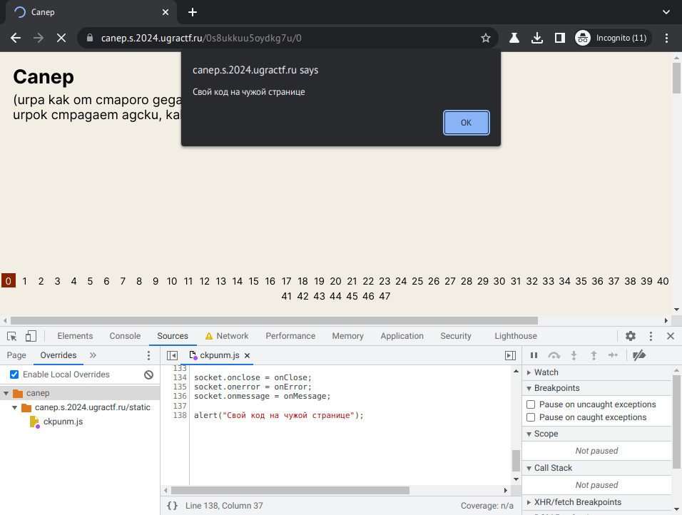

# Canep: Write-up

Сапёр. Классическая всем известная игра, только действие происходит в 3D на доске 14×14×10 — соседними для каждой клетки считаются клетки кубика 3×3×3, то есть цифры в квадратике (или вернее будет сказать кубике?) могут достигать 26. Слой доски можно выбирать вертикальной прокруткой; горизонтальная прокрутка поворачивает эту трёхмерную конструкцию, но ни на что не влияет. Внизу можно выбирать уровень от 0 до 47.

Немного поиграем вручную. Уровень 0 ничем не примечателен, а вот на других уровнях, даже на самом последнем, где попасть с первого хода не в мину достаточно тяжело, образуются крупные области без мин и даже без цифр. Примечательно, что пустые клетки — кубик 3×3×3 вокруг которых заведомо безопасен — не открываются рекурсивно, в отличие от того, как это происходит в классической версии. Попробуем это автоматизировать.

Изучим [выполняемый на странице _ckpunm.js_](app/statis/ckpunm.js). У нас создаётся вебсокет, на который навешиваются обработчики входящих данных и ошибок. Мы без труда можем написать свою функцию для `socket.onmessage`, которая будет вызывать всю уже существующую обработку с одним лишь дополнением: если только что открытая клетка оказалась пустой (`data.update[*].state == open && data.update[*].count == 0`), то можно отправить открываться все соседние клетки (аккуратно проверяя границы доски).

Не придётся даже в явном виде описывать рекурсию: указав, что при появлении пустой клетки надо открывать следующие, мы добьёмся того, что когда приедут данные по ним, откроются следующие вокруг них, и так далее. Единственное, что надо учесть — следует запоминать, в каких клетках мы были, и не открывать их повторно, иначе процесс быстро выйдет из-под контроля и будет топтаться на месте.

```javascript
let visited = new Set();

const myOnMessage = e => {
    let data = JSON.parse(e.data);

    if (data.update) {
        data.update.forEach(upd => {
            if (upd.state == "open" && upd.count == 0) {
                for (let dx = -1; dx <= 1; ++dx) {
                for (let dy = -1; dy <= 1; ++dy) {
                for (let dz = -1; dz <= 1; ++dz) {
                    let X = upd.x + dx;
                    let Y = upd.y + dy;
                    let Z = upd.z + dz;
                    if ((dx || dy || dz) && X >= 0 && Y >= 0 && Z >= 0 && X <= 13 && Y <= 13 && Z <= 9) {
                        let setKey = `${X},${Y},${Z}`;
                        if (!visited.has(setKey)) {
                            socket.send(JSON.stringify({"event": "click", "x": X, "y": Y, "z": Z}));
                            visited.add(setKey);
                        }
                    }
                }
                }
                }
            }
        });
    }

    onMessage(e);
}

window.addEventListener("load", e => {
    socket.onmessage = myOnMessage;
});
```

> _Здесь и далее происходящее в браузере показано увесистыми гифками. Дождитесь их загрузки (это может занять минуту или дольше) или смотрите их по прямым ссылкам._
> 
> [example.gif](writeup/example.gif)
> 
> 

Свой код со своими обработчиками событий можно просто вставить в консоль инспектора, но это неудобно: завершение игры требует перезагрузки страницы, а обнаружить пустую клетку раньше, чем мину, удаётся далеко не всегда.

Сделать более постоянные дополнения к коду страницы можно с помощью расширений вроде [Tampermonkey](https://www.tampermonkey.net/), либо — пользуясь тем, что скрипт грузится из отдельного файла — переопределить этот файл прямо в инспекторе: найти его на вкладке Sources, найти слева подвкладку Overrides и задать директорию для [хранения внесённых в инспекторе изменений](https://developer.chrome.com/blog/new-in-devtools-65/?utm_source=devtools#overrides).



Вот так выглядит пустота на первом уровне:

> [one-level.gif](writeup/one-level.gif)
> 
> 

Успешно пронаблюдав такое состояние на первых уровнях, можно кое-что заметить.

> [first-levels.gif](writeup/first-levels.gif)
> 
> 

Да-да, в таком виде в уровнях прячутся они — буквы флага.

Можно обнаружить, что каждый раз запускать процесс, надеясь случайно попасть в пустое место, неудобно. Добавим автоматический щелчок в случайное место при получении стартового сообщения от сокета:

```javascript
// const myOnMessage = e => { ...
    if (data.start) {
        let X = Math.floor(Math.random() * 14);
        let Y = Math.floor(Math.random() * 14);
        let Z = Math.floor(Math.random() * 10);
        socket.send(JSON.stringify({"event": "click", "x": X, "y": Y, "z": Z}));
    }
// ... }
```

Теперь можно просто обновлять и обновлять страницу, пока не попадётся большая пустота и не откроются все соответствующие ячейки. 

Но можно добавить и автоматическое обновление страницы в случае бомбы:

```javascript
// const myOnMessage = e => { ...
    // data.update.forEach(upd => { ...
            if (upd.state == "bomb") {
                window.location.reload();
            }
    // ... });
// ... }
```

А заодно — автоматическую перезагрузку страницы в случае, если нам не удалось добиться цепной реакции открытия ячеек за первые пару секунд:

```javascript
window.setTimeout(() => {
    if (visited.size < 50) {
        window.location.reload();
    }
}, 2000);
```

С первыми несколькими уровнями проблем нет, а вот дальше может понадобиться поднапрячь воображение: буквы могут стоять боком или лежать плашмя.

> [letter-sideways-and-lying.gif](writeup/letter-sideways-and-lying.gif)
> 
> 

Также растёт плотность мин — всё больше и больше запусков оканчиваются попаданием в бомбу с первого хода. Но благодаря автоматизации это не страшно: можно открывать уровни по порядку и просто, ничего не делая, ждать, когда появится буква.

Прорешав 47 уровней, выпишем флаг до конца.

[Полный код в одном файле](writeup/exploit.js)

Флаг: **ugra_[mparuk_gocmaem_kycok_nanupyca](https://www.tema.ru/rrr/ruslat/opera.html)_mppukxagenne**
