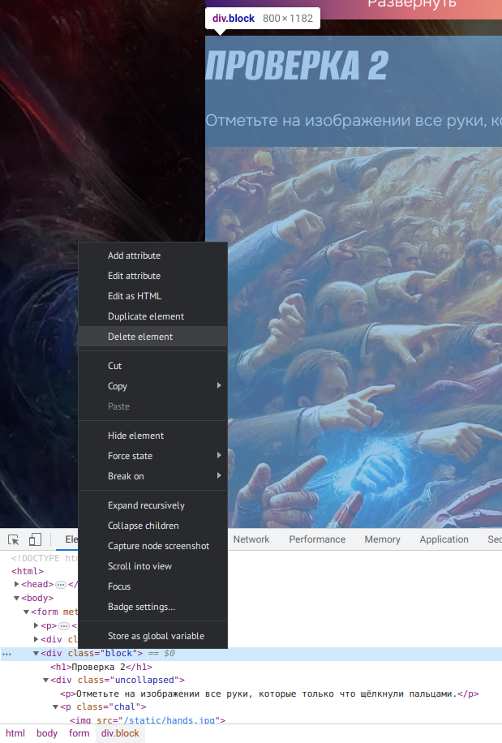
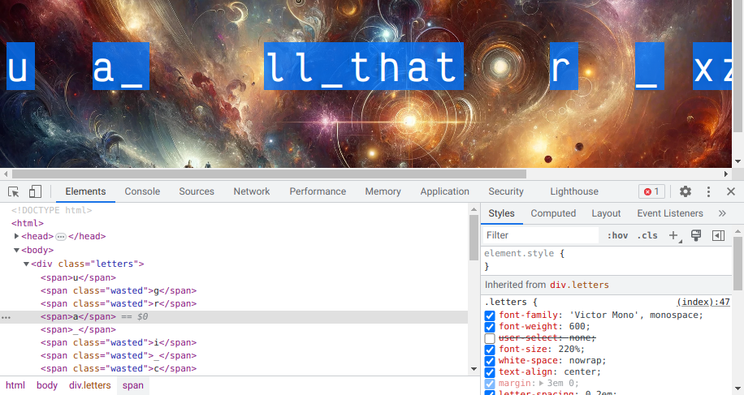

# Щелкапча: Write-up

> Щелчок Таноса — это знаковый момент во вселенной Marvel, который произошёл в фильме «Мстители: Война бесконечности» (2018). <…> Этот щелчок приводит к тому, что половина всего живого во вселенной мгновенно исчезает, превращаясь в пыль.
>
> _GPT-4_

На странице предлагается пройти две проверки, одна из которых очень лёгкая, а вторая — практически невозможная (да и теоретически, честно говоря, тоже).

Как указано, нам требуется пройти _все процедуры проверки, имеющиеся на данной странице_.

Удалим со страницы проверку, которую не можем пройти. Откроем инспектор (найдя _Inspect_ в контекстном меню), найдём и удалим соответствующий элемент:

Будет удалено также и поле с именем `challenge2`. Следовательно, в запросе на сервер вовсе не будет значения с таким именем. Уязвимость заключается в том, что сервер не проверяет правильность значений полей, которых нет.

Поскольку щелчок к этому моменту уже произошёл, половина букв исчезает. Впрочем, исчезают они лишь визуально — их по-прежнему можно найти в коде страницы или в инспекторе. Чтобы удобно скопировать весь флаг, можно найти CSS-свойство `user-select: none` и отключить его:

Другой вариант — просто пообновлять страницу: исчезают каждый раз разные буквы, а значит, можно за несколько обновлений достать их все.

Флаг: **ugra_i_call_that_mercy_sxzvr8c9jt20**
